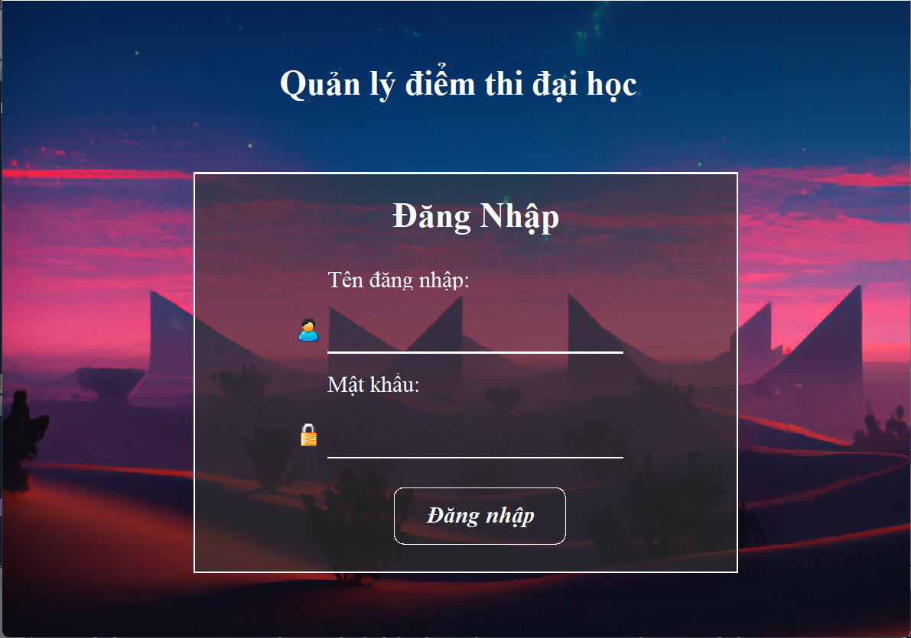
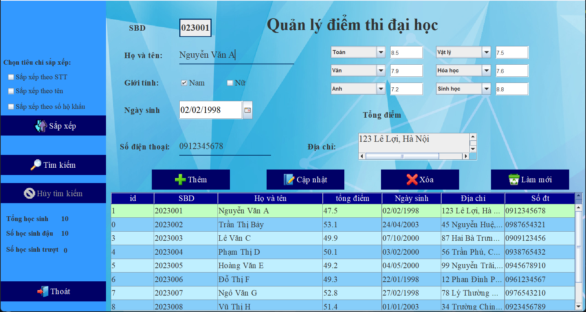
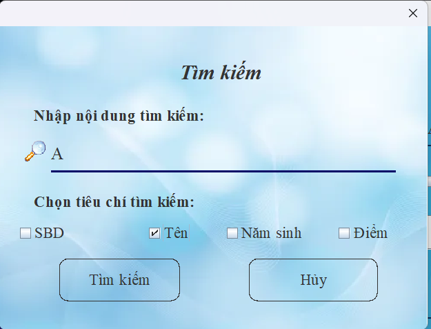

# 🎓 Quản Lý Điểm Thi Đại Học

Ứng dụng Java Swing quản lý điểm thi đại học, cho phép thêm, sửa, xóa, tìm kiếm và sắp xếp thông tin sinh viên dự thi, bao gồm các môn học và tổng điểm.
Account: admin|admin
---

## 🖥️ Giao Diện Chính

  
  


---

## 🚀 Chức Năng Chính

### 🔐 1. Đăng Nhập
- Người dùng đăng nhập bằng tài khoản và mật khẩu.
- Giao diện đẹp, dễ sử dụng.

### 🧾 2. Quản lý thông tin sinh viên
- **Thêm sinh viên**: nhập số báo danh, họ tên, ngày sinh, giới tính, địa chỉ, số điện thoại và 6 môn học cùng điểm số tương ứng.
- **Cập nhật sinh viên**: sửa thông tin một sinh viên đã có.
- **Xóa sinh viên**: xoá sinh viên theo SBD.
- **Làm mới**: xóa toàn bộ thông tin trên giao diện để nhập mới.

### 📚 3. Quản lý môn học và điểm số
- Chọn tối đa 6 môn từ danh sách môn thi: Toán, Văn, Anh, Lý, Hóa, Sinh, Lịch sử, Địa lý, GDCD.
- Các môn học không được trùng nhau trong cùng một sinh viên.
- Tính tổng điểm tự động từ 6 môn.

### 🔎 4. Tìm kiếm
- Giao diện tìm kiếm riêng, cho phép tìm theo:
  - ✅ Số báo danh (SBD)
  - ✅ Tên sinh viên
  - ✅ Năm sinh
  - ✅ Tổng điểm (theo điều kiện như `>5.0`, `<6.5`, `4.0-8.0`)

### 📊 5. Sắp xếp
- Sắp xếp sinh viên theo:
  - ✅ Số thứ tự (STT)
  - ✅ Tên
  - ✅ Số hộ khẩu (SBD)

### 🧠 6. Thống kê nhanh
- Tổng số sinh viên
- Số học sinh đậu
- Số học sinh trượt

### 💾 7. Lưu trữ dữ liệu
- Dữ liệu sinh viên được lưu trong file `students.xml`.
- Dùng `JAXB` để đọc/ghi dữ liệu XML.

---

## 🔧 Công nghệ sử dụng

- Java 8+
- Java Swing (Giao diện đồ họa)
- JAXB (Xử lý XML)
- Maven
- IDE : NetBeans

---

## 📁 Cấu trúc thư mục đề xuất

```
src/
├── action/
│   └── ManagerStudents.java
├── entity/
│   ├── Student.java
│   ├── Subject.java
│   └── StudentXML.java
├── utils/
│   └── FileUtils.java
└── ui/
    └── LoginFrame.java
    └── MainFrame.java
```